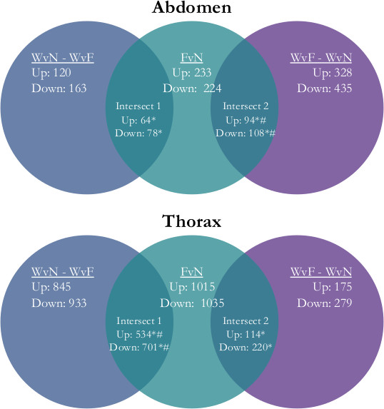
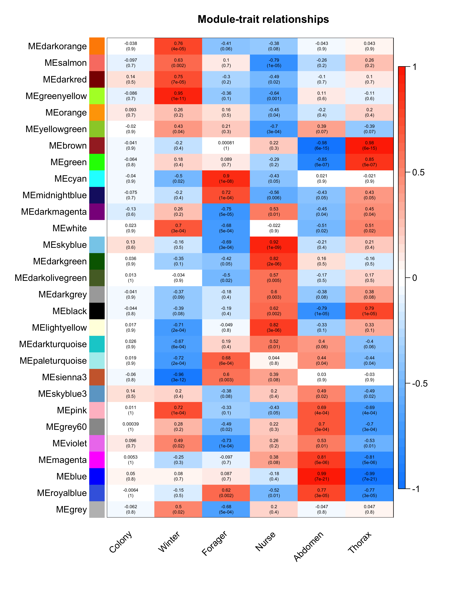
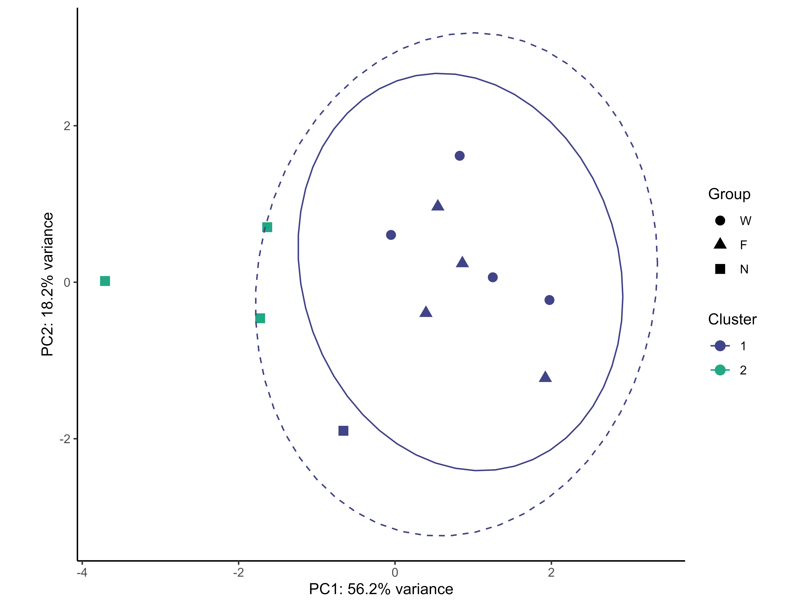

# Methods from: Adapting to Winter Conditions - Testing a 'Mix-and-Match' Model of the Winter Honey Bee Transcriptome

  * [NGS Data Processing Pipeline](#ngs-data-processing-pipeline)
  * [Differential gene expression analysis](#differential-gene-expression-analysis)
  * [Analysis of intersects](#analysis-of-intersects)
  * [WGCNA](#wgcna)
  * [K-means clustering](#k-means-clustering)
  * [Data Supplement: Additional PCAs, Sample Correlations, and K-means Clustering Analyses](#data-supplement)
  * [Version Information](#version-information)
  
***
#### Dependancies:
##### R packages: [dplyr](https://github.com/tidyverse/dplyr "dplyr"), [DESeq2](https://bioconductor.org/packages/release/bioc/html/DESeq2.html "DESeq2"), [ggplot2](https://ggplot2.tidyverse.org "ggplot2"),[gplots](https://cran.r-project.org/web/packages/gplots/index.html "gplots"),[viridis](https://cran.r-project.org/web/packages/viridis/vignettes/intro-to-viridis.html "viridis"), [ggpubr](https://cran.r-project.org/web/packages/ggpubr/index.html "ggpubr"), [RDAVIDWebService](https://bioconductor.org/packages/release/bioc/html/RDAVIDWebService.html "RDAVIDWebService"), [factoextra](https://cran.r-project.org/web/packages/factoextra/index.html "factoextra"), [WGCNA](https://cran.r-project.org/web/packages/WGCNA/index.html "WGCNA"), [RColorBrewer](https://cran.r-project.org/web/packages/RColorBrewer/index.html "RColorBrewer"), [tidyr](https://tidyr.tidyverse.org "tidyr")

##### Software: [Trim Galore](https://github.com/FelixKrueger/TrimGalore "Trim Galore"), [Cutadapt](https://github.com/marcelm/cutadapt "Cutadapt"), [samtools](https://github.com/samtools/samtools "samtools"), [Kallisto](https://pachterlab.github.io/kallisto/about.html "Kallisto"), [gffread](https://github.com/gpertea/gffread "gffread"), [FastQC](http://www.bioinformatics.babraham.ac.uk/projects/fastqc "FastQC")
***

## NGS Data Processing Pipeline
### Construction of reference transcriptome

The *Apis mellifera* [Amel_HAv3.1 genome](https://www.ncbi.nlm.nih.gov/assembly/GCF_003254395.2/ "Amel_HAv3.1 genome") was obtained via [the NCBI FTP site](http://ftp.ncbi.nlm.nih.gov/genomes/ "the NCBI FTP site")

All contigs in `Current Release/Assembled_chromosomes/seq` were combined into a single FASTA file

```{bash}
find *.fa.gz > contigs.txt
  
cat contigs.txt | while read i; do
  gunzip -k $i
done
  
cat *.fa > Amel_HAv3.1.fa
```
FASTA headers were modified for downstream use with Kallisto

```{bash}
awk -F"|" '/>/{$0=">"$2}1' Amel_HAv3.1.fa > Amel_HAv3.1_mod.fa
```
A Kallisto reference transcriptome was generated from the exon features of `Amel_HAv3.1_mod.fa` annotated in `ref_Amel_4.5_top_level.gff3`

```{bash}
gffread ref_Amel_HAv3.1_top_level.gff3 -T -M -K -o Amel_HAv3.1_reference.gtf

cat Amel_HAv3.1_reference.gtf | awk '$3 == "exon" { print $0 }' > Amel_HAv3.1_exon.gtf

convert2bed --input=gtf --output=bed < Amel_HAv3.1_exon.gtf | awk -v OFS='\t' '{print $1, $2, $3, $4, ".", $6}' | awk -v OFS='\t' '$4~/gene/' | uniq | sort -k1,1 -k2n,2n -k3n,3n | awk -v OFS='\t' '!seen[$1,$3,$4]++' > Amel_HAv3.1_transcriptome.bed

bedtools getfasta -name -s -fi Amel_HAv3.1_mod.fa -bed Amel_HAv3.1_transcriptome.bed> Amel_HAv3.1_transcriptome.fa

kallisto index --make-unique -i apiMelv3 Amel_HAv3.1_transcriptome.fa
```
***
### RNASeq Pipeline
#### Setup
`gff3.rna_to_ENTREZ.csv`
`targets.csv`

```{r}
library("dplyr")

### Set working directory to current script
if (Sys.getenv("RSTUDIO")=="1"){
  setwd(dirname(rstudioapi::getActiveDocumentContext()$path))
}else{setwd(getSrcDirectory()[1])}
targetspath <- getwd()

### Set paths
cutadaptpath <- "/Users/sbresnahan/anaconda3/bin/cutadapt"
kallistopath <- "/Users/sbresnahan/anaconda3/bin/kallisto"
kallisto_index <- paste(targetspath,"Amel_HAv3.1",sep="/")
IDconvertfile <- "gff3.rna_to_ENTREZ.csv"
debug = F

### Load targets info
targets <- read.csv(paste(targetspath,"/","targets.csv",sep=""),header=T)
targets$Prefix <- paste(targets$SampleName,targets$Colony,targets$Group,
                        targets$Tissue,targets$Replicate,sep="-")
targets <- targets %>%
  mutate_all(as.character)
targets$Pair <- as.integer(targets$Pair)
prefix_list <- unique(targets$Prefix)
```
***
#### QC: TrimGalore! & FastQC
##### Bash

```{bash}
trim_galore --fastqc --path_to_cutadapt path_to_cutadapt -j 4 --paired FILE1 FILE2 -o output_path
```
##### R

```{r}
outdirpath <- paste(targetspath,"/QC",sep="")
dir.create(outdirpath)
for (i in 1:length(prefix_list)){
  commands <- paste("bash -c 'trim_galore --fastqc --path_to_cutadapt",
                    cutadaptpath,"-j 4 --paired --dont_gzip",sep=" ")
  FILE1 <- targets[targets$Prefix==prefix_list[i]&targets$Pair==1,"FileName"]
  FILE1n <- paste(targetspath,FILE1,sep="/")
  FILE2 <- targets[targets$Prefix==prefix_list[i]&targets$Pair==2,"FileName"]
  FILE2n <- paste(targetspath,FILE2,sep="/")
  command_exec <- paste(commands,FILE1n,FILE2n,"-o",outdirpath,"'",sep=' ')
  if (debug==F){system(command_exec,wait=T)}
}
rm(commands,FILE1,FILE1n,FILE2,FILE2n,command_exec,i)
```
***
#### Pseudoalignment and transcript counts: Kallisto
##### Bash

```{bash}
kallisto quant -i index -o output_path -T 2 FILE1 FILE2
```
##### R

```{r}
outdirpath_kallisto <- paste(targetspath,"/kallisto",sep="")
trimmed_files <- Sys.glob(paste(outdirpath,"*.fq",sep="/"))
targets_kallisto <- list()
for (i in 1:length(prefix_list)){
  z <- (i*2)-1
  FILE1i <- trimmed_files[z]
  FILE2i <- trimmed_files[z+1]
  FILEo <- gsub(".*/","",FILE1i)
  FILEo <- sapply(strsplit(FILEo,"_"), "[", 1)
  diro <- paste(outdirpath_kallisto,FILEo,sep="_")
  targets_kallisto <- append(targets_kallisto,diro)
  command_exec <- paste("bash -c '",kallistopath,
                        "quant -i",kallisto_index,"-o",diro,
                    "-t 4",FILE1i,FILE2i,"'",sep=" ")
  if (debug==F){system(command_exec,wait=T)}
}
rm(i,z,FILE1i,FILE2i,trimmed_files,command_exec)
```
***

#### Combine counts for each sample into single dataframe
```{r}
if (debug==F){
  init <- read.table(paste(unlist(targets_kallisto[1]),"abundance.tsv",sep="/"),
                     header=T,stringsAsFactors = F)
  init <- unique(sapply(strsplit(as.character(init$target_id),"_"), "[", 1))

  counts_df <- data.frame(matrix(ncol=length(prefix_list),
                                 nrow=length(init)))
  row.names(counts_df) <- init
  names(counts_df) <- prefix_list

  tpm_df <- data.frame(matrix(ncol=length(prefix_list),
                              nrow=length(init)))
  row.names(tpm_df) <- init
  names(tpm_df) <- prefix_list

  for (i in 1:length(targets_kallisto)){
    FILEi <- paste(unlist(targets_kallisto[i]),"abundance.tsv",sep="/")
    temp <- read.table(FILEi,header=T,stringsAsFactors = F)
    temp$target_id <- sapply(strsplit(as.character(temp$target_id),"_"), "[", 1)
    temp <- temp %>%
      group_by(target_id) %>%
      summarise_all(list(sum))
    temp <- temp[order(nchar(temp$target_id), temp$target_id),]
    counts_df[[unlist(prefix_list[i])]] <- temp$est_counts
    tpm_df[[unlist(prefix_list[i])]] <- temp$tpm
  }
}
rm(init,FILEi,temp,i,cutadaptpath,kallisto_index,targets_kallisto,debug,
   IDconvertpath,targets_QC,kallistopath,outdirpath,outdirpath_kallisto)
```

***
#### Group transcript counts by gene and sum
```{r}
IDconvert <- read.csv(IDconvertfile,header=T,stringsAsFactors = F)
IDconvert$ENTREZ <- as.character(IDconvert$ENTREZ)
convert_g <- grep('gene', row.names(counts_df), value=TRUE)
convert_g <- convert_g[convert_g%in%IDconvert$geneID]
convert <- convert_g
counts_df <- counts_df[match(convert, row.names(counts_df)),]
tpm_df <- tpm_df[match(convert, row.names(tpm_df)),]
convert_to <- list()
for (i in row.names(counts_df)){
  convert_to <- append(convert_to,unlist(unique(IDconvert[IDconvert$geneID==i,"ENTREZ"])))
}
row.names(counts_df) <- convert_to
row.names(tpm_df) <- convert_to
write.csv(counts_df,paste(targetspath,"kallisto_counts_transcriptome.csv",sep="/"))
write.csv(tpm_df,paste(targetspath,"kallisto_tpm_counts_transcriptome.csv",sep="/"))
rm(IDconvert,temp,convert_to,convert,convert_g,i,IDconvertfile,outdirpath_gene,prefix_list)
```
***
#### Save image and clean up
```{r}
save(targets,prefix_list,counts_df,
     file=paste(targetspath,"WB_RNASeqPipeline.RData",sep="/"))
rm(list=ls())
```
***
## Differential gene expression analysis
#### Setup
```{r}
library("dplyr")
library("DESeq2")
library("ggplot2")
library("viridis")
library("ggpubr")
library("RDAVIDWebService")
library("gplots")

### Set working directory to current script
if (Sys.getenv("RSTUDIO")=="1"){
  setwd(dirname(rstudioapi::getActiveDocumentContext()$path))
}else{setwd(getSrcDirectory()[1])}
targetspath <- getwd()

### Load WB_RNASeqPipeline Output
load(paste(targetspath,"WB_RNASeqPipeline.RData",sep="/"))

### Create figures path
figurespath <- paste(targetspath,"Figures",sep="/")
```
##### Print plot function
```{r}
plot.print <- function(path,file.name){
  png(file=paste(path,file.name,sep="/"),
      width=8,height=6,units="in",res=1200,pointsize=10)
  par(mar=c(.2,.05,1,1),
      cex.main = 400,
      cex.lab = 100,
      cex.axis = 50)
  dev.set(2)
  dev.copy(which=4)
  dev.off()
  dev.off()
}
```
##### Modified plotPCA function
```{r}
plot.plotPCA <- function (data,title,sample.info,returnData=F,tissueSpecific=F)
{
  pca <- prcomp(t(data))
  percentVar <- pca$sdev^2/sum(pca$sdev^2)
  d <- data.frame(PC1 = pca$x[, 1], PC2 = pca$x[, 2], Group = sample.info$Group,
                  Tissue = sample.info$Tissue)
  if (returnData){
    attr(d, "percentVar") <- percentVar[1:2]
    return(d)
  }
  if (tissueSpecific==F){g <- ggplot(data = d, aes_string(x = "PC1", y = "PC2", color = "Group",shape = "Tissue"))}else{
    g <- ggplot(data = d, aes_string(x = "PC1", y = "PC2", color = "Group"))}
  g + scale_color_manual(values=viridis(5)[c(2:4)]) + ggtitle(title) +
    geom_point(size = 3) + xlab(paste0("PC1: ", round(percentVar[1] * 100), "% variance")) +
    ylab(paste0("PC2: ", round(percentVar[2] * 100), "% variance")) + coord_fixed() + theme_classic()
}
```
##### Plot hclust heatmap function
```{r}
plot.hclust <- function(data,title,tissueSpecific=F,tissue=c("A","T")){
  num_conditions <- nlevels(samples$Group)
  pal <- viridis(num_conditions)
  if (tissueSpecific==F){cond_colors <- pal[as.integer(samples$Group)]}else{
    cond_colors <- pal[as.integer(samples[samples$Tissue==tissue,"Group"])]
  }
  heat <- heatmap.2(cor(data), RowSideColors=cond_colors,
                  trace='none', main=title, margins=c(15,15),
                  col=viridis(100),key.par=list(mar=c(5.5, 2.5, 2.5, 2)),tracecol="white")
  heat
  legend(y=-.065, x=-.075, xpd=TRUE,     
       legend = levels(samples$Group),
       col = pal, lty= 1,lwd = 4, cex=.75)
}
```
##### DAVID GO Enrichment Analysis function
```{r}
DAVID.GO <- function(FG,BG,file.name){
  david <- DAVIDWebService$new(email='sbresnahan@psu.edu',
                               url="https://david.ncifcrf.gov/webservice/services/DAVIDWebService.DAVIDWebServiceHttpSoap12Endpoint/")
  setTimeOut(david,100000)
  FG <- addList(david, FG, idType="ENTREZ_GENE_ID",
                listName="isClass", listType="Gene")
  BG <- addList(david, BG, idType="ENTREZ_GENE_ID",
                listName="all", listType="Background")
  setAnnotationCategories(david,
                          c("GOTERM_BP_DIRECT", "GOTERM_MF_DIRECT",
                            "GOTERM_CC_DIRECT","KEGG_PATHWAY","COG_ONTOLOGY",
                            "UP_KEYWORDS","INTERPRO","PIR_SUPERFAMILY","SMART"))
  FuncAnnotChart <- data.frame(getFunctionalAnnotationChart(david))
  write.csv(FuncAnnotChart,paste(targetspath,"/",file.name,sep=""))
  return(FuncAnnotChart)
}
```
##### Contrast function (DEG = p < 0.01)
```{r}
cond.contrast <- function(object,data,contVar,group1,group2,save.results=T,results.filename,
                          GOEA=T,GO.up.filename,GO.down.filename){
  BG.list <- row.names(data)
  res <- data.frame(results(object, contrast=c(contVar,group1,group2)))
  res <- res[order(res$padj),]
  DEGs <- res[res$padj<0.01,]
  DEGs <- na.omit(DEGs)
  up <- row.names(DEGs[DEGs$log2FoldChange>0,])
  down <- row.names(DEGs[DEGs$log2FoldChange<0,])
  if(save.results==T){write.csv(DEGs,paste(targetspath,results.filename,sep="/"))}
  if(GOEA==T){
    DAVID.GO(FG=up,BG=BG.list,GO.up.filename)
    DAVID.GO(FG=down,BG=BG.list,GO.down.filename)
  }
  return(list(up,down,res))
}
```
***
#### Sample info and gene expression data
##### Sample info
```{r}
samples <- targets[,c("Colony","Group","Tissue","Replicate","Prefix")] %>% distinct()
samples$Colony <- as.factor(samples$Colony)
samples$Group <- as.factor(samples$Group)
samples$Tissue <- as.factor(samples$Tissue)
names(samples)[5] <- "Sample"
samples$Group <- relevel(samples$Group, "W")
samples$Group_Tissue <- as.factor(paste(samples$Group,samples$Tissue,sep="_"))
samples0 <- samples #Create Backup
```
##### Gene expression
Remove low count genes and genes with 0 variance
```{r}
datExpr <- counts_df
datExpr <- data.frame(lapply(datExpr, function(x) as.integer(as.character(x))))
names(datExpr) <- names(counts_df)
row.names(datExpr) <- row.names(counts_df)

# Remove genes with 0 variance
datExpr <- datExpr[-c(which(apply(datExpr, 1, var)==0)),]

# Remove low count genes
datExpr <- datExpr[rowMeans(datExpr!=0)>0.25, ]
datExpr <- cbind(row.names(datExpr),datExpr)
names(datExpr) <- c("geneID",samples$Sample)
datExpr0 <- datExpr # Create backup

# Cleanup
rm(counts_df)
```
***
#### DESeq2 Pipeline
```{r}
DESeq2.pipeline <- function(data,sample.info,save.VSTCounts=T){
### DESeq2: Abdomen & Thorax
  print("Running DESeq2 for: Abdomen & Thorax Samples")
  dds <<- DESeqDataSetFromMatrix(countData=data,
                              colData=sample.info,
                              design=~Colony+Tissue+Group,tidy=TRUE)
  dds <<- DESeq(dds)
  dds_transform <<- data.frame(assay(varianceStabilizingTransformation(dds)))
  names(dds_transform) <<- sample.info$Sample

### DESeq2: Abdomen
  print("Running DESeq2 for: Abdomen Samples")
  abdomen_datExpr <<- data[,names(data)%in%sample.info[sample.info$Tissue=="A","Sample"]]
  abdomen_datExpr <<- cbind(data$geneID,abdomen_datExpr)
  abdomen_dds <<- DESeqDataSetFromMatrix(countData=abdomen_datExpr,
                                      colData=sample.info[sample.info$Tissue=="A",],
                                      design=~Colony+Group,tidy=TRUE)
  abdomen_dds <<- DESeq(abdomen_dds)
  abdomen_dds_transform <<- data.frame(assay(varianceStabilizingTransformation(abdomen_dds)))
  names(abdomen_dds_transform) <<- sample.info[sample.info$Tissue=="A","Sample"]

### DESeq2: Thorax
  print("Running DESeq2 for: Thorax Samples")
  thorax_datExpr <<- data[,names(data)%in%sample.info[samples$Tissue=="T","Sample"]]
  thorax_datExpr <<- cbind(data$geneID,thorax_datExpr)
  thorax_dds <<- DESeqDataSetFromMatrix(countData=thorax_datExpr,
                                     colData=sample.info[sample.info$Tissue=="T",],
                                     design=~Colony+Group,tidy=TRUE)
  thorax_dds <<- DESeq(thorax_dds)
  thorax_dds_transform <<- data.frame(assay(varianceStabilizingTransformation(thorax_dds)))
  names(thorax_dds_transform) <<- sample.info[sample.info$Tissue=="T","Sample"]

### Save VST Counts
  if (save.VSTCounts==T){
    write.csv(dds_transform,paste(targetspath,"vstTransformCounts.csv",sep="/"))
  }

### Abdomen and Thorax PCAs
  # Abdomen
  p_all_A <<- plot.plotPCA(abdomen_dds_transform,"Abdomen PCA",
                             sample.info[sample.info$Tissue=="A",],
                             returnData=F,tissueSpecific=T)
  # Thorax
  p_all_T <<- plot.plotPCA(thorax_dds_transform,"Thorax PCA",
                             sample.info[sample.info$Tissue=="T",],
                             returnData=F,tissueSpecific=T)
}
```
***
#### Initial check for sample clustering and outliers
```{r}
DESeq2.pipeline(datExpr,samples)
```
##### Figure A: PCA of all samples
```{r}
plot.plotPCA(dds_transform,"",samples,returnData=F,tissueSpecific=F)
plot.print(figurespath,"Figure_A.png")
```


##### Figure B: Abdomen and thorax sample PCAs
```{r}
ggarrange(p_all_A, p_all_T, ncol = 2, nrow = 1)
plot.print(figurespath,"Figure_B.png")
```


##### Figure C: Correlation heatmap of all samples
```{r}
plot.hclust(dds_transform,'Sample Correlations')
plot.print(figurespath,"Figure_C.png")
```


##### Figure D: Correlation heatmap of abdomen samples
```{r}
plot.hclust(abdomen_dds_transform,'Abdomen Sample Correlations',tissueSpecific=T,tissue="A")
plot.print(figurespath,"Figure_D.png")
```


##### Figure E: Correlation heatmap of thorax samples
```{r}
plot.hclust(thorax_dds_transform,'Thorax Sample Correlations',tissueSpecific=T,tissue="T")
plot.print(figurespath,"Figure_E.png")
```


***
#### Removal of outlier samples
Due to innapropriate clustering, MD-S9-253-N-A-1 and MD-S11-266-N-A-3 were removed from this point forward.
```{r}
samples <- samples[-c(9,11),]
datExpr$`MD-S9-253-N-A-1` <- NULL
datExpr$`MD-S11-266-N-A-3` <- NULL
DESeq2.pipeline(datExpr,samples,save.VSTCounts=F)
```
##### Figure F: PCA of all samples
```{r}
plot.plotPCA(dds_transform,"",samples,returnData=F,tissueSpecific=F)
plot.print(figurespath,"Figure_F.png")
```


##### Figure G: Abdomen and thorax sample PCAs
```{r}
ggarrange(p_all_A, p_all_T, ncol = 2, nrow = 1)
plot.print(figurespath,"Figure_G.png")
```


##### Figure H: Sample correlation heatmap
```{r}
plot.hclust(dds_transform,'Sample Correlations')
plot.print(figurespath,"Figure_H.png")
```


##### Figure I: Abdomen sample correlation heatmap
```{r}
plot.hclust(abdomen_dds_transform,'Abdomen Sample Correlations',tissueSpecific=T,tissue="A")
plot.print(figurespath,"Figure_I.png")
```


##### Figure J: Thorax sample correlation heatmap
```{r}
plot.hclust(thorax_dds_transform,'Thorax Sample Correlations',tissueSpecific=T,tissue="T")
plot.print(figurespath,"Figure_J.png")
```


***
#### Abdomen tissue intra-group contrasts
##### Nurses vs. Foragers
```{r}
NvF_A <- cond.contrast(abdomen_dds,datExpr,"Group","N","F",save.results=T,"NvF_A_DEGs.csv",GOEA=T,"NvF_A_up_GO.csv","NvF_A_down_GO.csv")
write.csv(NvF_A[[3]],paste(targetspath,"NvF_A_allResults.csv",sep="/"))
```

##### Foragers vs. Nurses
```{r}
FvN_A <- cond.contrast(abdomen_dds,datExpr,"Group","F","N",save.results=F,NA,GOEA=F)
```
##### Winter bees vs. Nurses
```{r}
WvN_A <- cond.contrast(abdomen_dds,datExpr,"Group","W","N",save.results=T,"WvN_A_DEGs.csv",GOEA=T,"WvN_A_up_GO.csv","WvN_A_down_GO.csv")
write.csv(WvN_A[[3]],paste(targetspath,"WvN_A_allResults.csv",sep="/"))
```

##### Winter bees vs. Foragers
```{r}
WvF_A <- cond.contrast(abdomen_dds,datExpr,"Group","W","F",save.results=T,"WvF_A_DEGs.csv",GOEA=T,"WvF_A_up_GO.csv","WvF_A_down_GO.csv")
write.csv(WvF_A[[3]],paste(targetspath,"WvF_A_allResults.csv",sep="/"))
```

***

#### Thorax tissue intra-group contrasts
##### Nurses vs. Foragers
```{r}
NvF_A <- NvF_T <- cond.contrast(thorax_dds,datExpr,"Group","N","F",save.results=T,"NvF_T_DEGs.csv",GOEA=T,"NvF_T_up_GO.csv","NvF_T_down_GO.csv")
write.csv(NvF_T[[3]],paste(targetspath,"NvF_T_allResults.csv",sep="/"))
```

##### Foragers vs. Nurses
```{r}
FvN_T <- cond.contrast(thorax_dds,datExpr,"Group","F","N",save.results=F,NA,GOEA=F)
```
##### Winter bees vs. Nurses
```{r}
WvN_T <- cond.contrast(thorax_dds,datExpr,"Group","W","N",save.results=T,"WvN_T_DEGs.csv",GOEA=T,"WvN_T_up_GO.csv","WvN_T_down_GO.csv")
write.csv(WvN_T[[3]],paste(targetspath,"WvN_T_allResults.csv",sep="/"))
```

##### Winter bees vs. Foragers
```{r}
WvF_T <- cond.contrast(thorax_dds,datExpr,"Group","W","F",save.results=T,"WvF_T_DEGs.csv",GOEA=T,"WvF_T_up_GO.csv","WvF_T_down_GO.csv")
write.csv(WvF_T[[3]],paste(targetspath,"WvF_T_allResults.csv",sep="/"))
```

***

#### Intra-tissue contrasts (abdomen vs. thorax)
```{r}
AvT_dds <- DESeqDataSetFromMatrix(countData=datExpr,
                                  colData=samples,
                                  design=~Colony+Group_Tissue,tidy=TRUE)
AvT_dds <- DESeq(AvT_dds)
```
##### Nurses
```{r}
cond.contrast(AvT_dds,datExpr,"Group_Tissue","N_A","N_T",save.results=T,"AvT_N_DEGs.csv",GOEA=T,"AvT_N_up_GO.csv","AvT_N_down_GO.csv")
```

##### Foragers
```{r}
cond.contrast(AvT_dds,datExpr,"Group_Tissue","F_A","F_T",save.results=T,"AvT_F_DEGs.csv",GOEA=T,"AvT_F_up_GO.csv","AvT_F_down_GO.csv")
```

##### Winter bees
```{r}
cond.contrast(AvT_dds,datExpr,"Group_Tissue","W_A","W_T",save.results=T,"AvT_W_DEGs.csv",GOEA=T,"AvT_W_up_GO.csv","AvT_W_down_GO.csv")
```

***

#### Save image and clean up
```{r}
rm(DESeq2.pipeline,cond.contrast,AvT_dds)
save.image(file=paste(targetspath,"WB_DESeq2.RData",sep="/"))
rm(list=ls())
```

***

## Analysis of intersects
#### Setup
```{r}
library("RDAVIDWebService")

### Set working directory to current script
if (Sys.getenv("RSTUDIO")=="1"){
  setwd(dirname(rstudioapi::getActiveDocumentContext()$path))
}else{setwd(getSrcDirectory()[1])}
targetspath <- getwd()

### Load WB_DESeq2 Output
load(paste(targetspath,"WB_DESeq2.RData",sep="/"))

gene_list <- length(row.names(datExpr))
```
##### Fisher's Exact Test function
```{r}
FET <- function(x,y,z){
  fisher.test(matrix(c(length(intersect(x,y)),length(setdiff(x,y)),length(setdiff(y,x)),
                     z-length(union(x,y))),nrow=2),alternative="greater")[["p.value"]]
}
```
***
#### Fisher's Exact Tests: Abdomen Intersects
##### Intersect 1: up-regulated
```{r}
WvN_FvN_A_up <- FET(setdiff(WvN_A[[1]],WvF_A[[1]]),FvN_A[[1]],gene_list)
```
##### Intersect 1: down-regulated
```{r}
WvN_FvN_A_down <- FET(setdiff(WvN_A[[2]],WvF_A[[2]]),FvN_A[[2]],gene_list)
```
##### Intersect 2: up-regulated
```{r}
WvF_NvF_A_up <- FET(setdiff(WvF_A[[1]],WvN_A[[1]]),NvF_A[[1]],gene_list)
```
##### Intersect 2: down-regulated
```{r}
WvF_NvF_A_down <- FET(setdiff(WvF_A[[2]],WvN_A[[2]]),NvF_A[[2]],gene_list)
```
***
#### Fisher's Exact Tests: Thorax Intersects
##### Intersect 1: up-regulated
```{r}
WvN_FvN_T_up <- FET(setdiff(WvN_T[[1]],WvF_T[[1]]),FvN_T[[1]],gene_list)
```
##### Intersect 1: down-regulated
```{r}
WvN_FvN_T_down <- FET(setdiff(WvN_T[[2]],WvF_T[[2]]),FvN_T[[2]],gene_list)
```
##### Intersect 2: up-regulated
```{r}
WvF_NvF_T_up <- FET(setdiff(WvF_T[[1]],WvN_T[[1]]),NvF_T[[1]],gene_list)
```
##### Intersect 2: down-regulated
```{r}
WvF_NvF_T_down <- FET(setdiff(WvF_T[[2]],WvN_T[[2]]),NvF_T[[2]],gene_list)
```
***
#### Construct intersect descriptions and Fisher's Exact Test tables
```{r}
FET_res <- data.frame(matrix(ncol=11,nrow=8))
names(FET_res) <- c("Test","W","Wv(F,N)","setdiff","F,N","setdiff-F/N","F/N-setdiff",
                    "Genome-Union","Intersect","Genome-Intersect","fisher_p")
FET_res$Test <- c("Abdomen: Intersect 1 Upregulated","Abdomen: Intersect 1 Downregulated",
                  "Abdomen: Intersect 2 Upregulated","Abdomen: Intersect 2 Downregulated",
                  "Thorax: Intersect 1 Upregulated","Thorax: Intersect 1 Downregulated",
                  "Thorax: Intersect 2 Upregulated","Thorax: Intersect 2 Downregulated")
FET_res$W <- c(length(WvN_A[[1]]),length(WvN_A[[2]]),length(WvF_A[[1]]),length(WvF_A[[2]]),
               length(WvN_T[[1]]),length(WvN_T[[2]]),length(WvF_T[[1]]),length(WvF_T[[2]]))
FET_res$setdiff <- c(length(setdiff(WvN_A[[1]],WvF_A[[1]])),length(setdiff(WvN_A[[2]],WvF_A[[2]])),
                     length(setdiff(WvF_A[[1]],WvN_A[[1]])),length(setdiff(WvF_A[[2]],WvN_A[[2]])),
                     length(setdiff(WvN_T[[1]],WvF_T[[1]])),length(setdiff(WvN_T[[2]],WvF_T[[2]])),
                     length(setdiff(WvF_T[[1]],WvN_T[[1]])),length(setdiff(WvF_T[[2]],WvN_T[[2]])))
FET_res$`Wv(F,N)` <- c(length(WvF_A[[1]]),length(WvF_A[[2]]),length(WvN_A[[1]]),length(WvN_A[[2]]),
                       length(WvF_T[[1]]),length(WvF_T[[2]]),length(WvN_T[[1]]),length(WvN_T[[2]]))
FET_res$`F,N` <- c(length(FvN_A[[1]]),length(FvN_A[[2]]),length(NvF_A[[1]]),length(NvF_A[[2]]),
                   length(FvN_T[[1]]),length(FvN_T[[2]]),length(NvF_T[[1]]),length(NvF_T[[2]]))
FET_res$`setdiff-F/N` <- c(length(setdiff(setdiff(WvN_A[[1]],WvF_A[[1]]),FvN_A[[1]])),
                           length(setdiff(setdiff(WvN_A[[2]],WvF_A[[2]]),FvN_A[[2]])),
                           length(setdiff(setdiff(WvF_A[[1]],WvN_A[[1]]),NvF_A[[1]])),
                           length(setdiff(setdiff(WvF_A[[2]],WvN_A[[2]]),NvF_A[[2]])),
                           length(setdiff(setdiff(WvN_T[[1]],WvF_T[[1]]),FvN_T[[1]])),
                           length(setdiff(setdiff(WvN_T[[2]],WvF_T[[2]]),FvN_T[[2]])),
                           length(setdiff(setdiff(WvF_T[[1]],WvN_T[[1]]),NvF_T[[1]])),
                           length(setdiff(setdiff(WvF_T[[2]],WvN_T[[2]]),NvF_T[[2]])))
FET_res$`F/N-setdiff` <- c(length(setdiff(FvN_A[[1]],setdiff(WvN_A[[1]],WvF_A[[1]]))),
                           length(setdiff(FvN_A[[2]],setdiff(WvN_A[[2]],WvF_A[[2]]))),
                           length(setdiff(NvF_A[[1]],setdiff(WvF_A[[1]],WvN_A[[1]]))),
                           length(setdiff(NvF_A[[2]],setdiff(WvF_A[[2]],WvN_A[[2]]))),
                           length(setdiff(FvN_T[[1]],setdiff(WvN_T[[1]],WvF_T[[1]]))),
                           length(setdiff(FvN_T[[2]],setdiff(WvN_T[[2]],WvF_T[[2]]))),
                           length(setdiff(NvF_T[[1]],setdiff(WvF_T[[1]],WvN_T[[1]]))),
                           length(setdiff(NvF_T[[2]],setdiff(WvF_T[[2]],WvN_T[[2]]))))
FET_res$`Genome-Union` <- c(gene_list-length(union(setdiff(WvN_A[[1]],WvF_A[[1]]),FvN_A[[1]])),
                            gene_list-length(union(setdiff(WvN_A[[2]],WvF_A[[2]]),FvN_A[[2]])),
                            gene_list-length(union(setdiff(WvF_A[[1]],WvN_A[[1]]),NvF_A[[1]])),
                            gene_list-length(union(setdiff(WvF_A[[2]],WvN_A[[2]]),NvF_A[[2]])),
                            gene_list-length(union(setdiff(WvN_T[[1]],WvF_T[[1]]),FvN_T[[1]])),
                            gene_list-length(union(setdiff(WvN_T[[2]],WvF_T[[2]]),FvN_T[[2]])),
                            gene_list-length(union(setdiff(WvF_T[[1]],WvN_T[[1]]),NvF_T[[1]])),
                            gene_list-length(union(setdiff(WvF_T[[2]],WvN_T[[2]]),NvF_T[[2]])))
FET_res$Intersect <- c(length(intersect(setdiff(WvN_A[[1]],WvF_A[[1]]),FvN_A[[1]])),
                       length(intersect(setdiff(WvN_A[[2]],WvF_A[[2]]),FvN_A[[2]])),
                       length(intersect(setdiff(WvF_A[[1]],WvN_A[[1]]),NvF_A[[1]])),
                       length(intersect(setdiff(WvF_A[[2]],WvN_A[[2]]),NvF_A[[2]])),
                       length(intersect(setdiff(WvN_T[[1]],WvF_T[[1]]),FvN_T[[1]])),
                       length(intersect(setdiff(WvN_T[[2]],WvF_T[[2]]),FvN_T[[2]])),
                       length(intersect(setdiff(WvF_T[[1]],WvN_T[[1]]),NvF_T[[1]])),
                       length(intersect(setdiff(WvF_T[[2]],WvN_T[[2]]),NvF_T[[2]])))
FET_res$`Genome-Intersect` <- c(gene_list-length(intersect(setdiff(WvN_A[[1]],WvF_A[[1]]),FvN_A[[1]])),
                                gene_list-length(intersect(setdiff(WvN_A[[2]],WvF_A[[2]]),FvN_A[[2]])),
                                gene_list-length(intersect(setdiff(WvF_A[[1]],WvN_A[[1]]),NvF_A[[1]])),
                                gene_list-length(intersect(setdiff(WvF_A[[2]],WvN_A[[2]]),NvF_A[[2]])),
                                gene_list-length(intersect(setdiff(WvN_T[[1]],WvF_T[[1]]),FvN_T[[1]])),
                                gene_list-length(intersect(setdiff(WvN_T[[2]],WvF_T[[2]]),FvN_T[[2]])),
                                gene_list-length(intersect(setdiff(WvF_T[[1]],WvN_T[[1]]),NvF_T[[1]])),
                                gene_list-length(intersect(setdiff(WvF_T[[2]],WvN_T[[2]]),NvF_T[[2]])))
FET_res$fisher_p <- c(WvN_FvN_A_up,WvN_FvN_A_down,WvF_NvF_A_up,WvF_NvF_A_down,
                      WvN_FvN_T_up,WvN_FvN_T_down,WvF_NvF_T_up,WvF_NvF_T_down)
write.csv(FET_res,paste(targetspath,"FET_results.csv",sep="/"),row.names=F)
rm(WvN_FvN_A_up,WvN_FvN_A_down,WvF_NvF_A_up,WvF_NvF_A_down,
   WvN_FvN_T_up,WvN_FvN_T_down,WvF_NvF_T_up,WvF_NvF_T_down)
```

***

#### GO Enrichment Analyses of intersects
```{r}
intersects <- list(c(intersect(setdiff(WvN_A[[1]],WvF_A[[1]]),FvN_A[[1]])),
                   c(intersect(setdiff(WvN_A[[2]],WvF_A[[2]]),FvN_A[[2]])),
                   c(intersect(setdiff(WvF_A[[1]],WvN_A[[1]]),NvF_A[[1]])),
                   c(intersect(setdiff(WvF_A[[2]],WvN_A[[2]]),NvF_A[[2]])),
                   c(intersect(setdiff(WvN_T[[1]],WvF_T[[1]]),FvN_T[[1]])),
                   c(intersect(setdiff(WvN_T[[2]],WvF_T[[2]]),FvN_T[[2]])),
                   c(intersect(setdiff(WvF_T[[1]],WvN_T[[1]]),NvF_T[[1]])),
                   c(intersect(setdiff(WvF_T[[2]],WvN_T[[2]]),NvF_T[[2]])))

for (i in 1:length(FET_res[,"Test"])){
  test_name <- paste(sapply(strsplit(FET_res[i,"Test"],": "), "[", c(1,2)),collapse=" ")
  print(test_name)
  gene_set <- unlist(intersects[i])
  DAVID.GO(gene_set,row.names(datExpr),paste(test_name,"_GO.csv",sep=""))
}
```

***

#### Chi Squared tests
##### (TO DO)

***
#### Intersects Fisher's Exact and Chi Squared tests figure


***
#### Save image and clean up
```{r}
rm(i,FET,gene_list,FET_res,gene_set)
save.image(file=paste(targetspath,"WB_Intersects.RData",sep="/"))
rm(list=ls())
```
***

## WGCNA
#### Setup
```{r}
library("dplyr")
library("ggplot2")
library("viridis")
library("ggpubr")
library("RDAVIDWebService")
library("WGCNA")
library('RColorBrewer')

### Set working directory to current script
if (Sys.getenv("RSTUDIO")=="1"){
  setwd(dirname(rstudioapi::getActiveDocumentContext()$path))
}else{setwd(getSrcDirectory()[1])}
targetspath <- getwd()

### Load WB_Intersects Output
load(paste(targetspath,"WB_Intersects.RData",sep="/"))

##### DAVID GO Enrichment Analysis Function
DAVID.GO <- function(FG,BG,file.name,save.file=T){
  david <- DAVIDWebService$new(email='sbresnahan@psu.edu',
                               url="https://david.ncifcrf.gov/webservice/services/DAVIDWebService.DAVIDWebServiceHttpSoap12Endpoint/")
  setTimeOut(david,100000)
  FG <- addList(david, FG, idType="ENTREZ_GENE_ID",
                listName="isClass", listType="Gene")
  BG <- addList(david, BG, idType="ENTREZ_GENE_ID",
                listName="all", listType="Background")
  setAnnotationCategories(david,
                          c("GOTERM_BP_DIRECT", "GOTERM_MF_DIRECT",
                            "GOTERM_CC_DIRECT","KEGG_PATHWAY","COG_ONTOLOGY",
                            "UP_KEYWORDS","INTERPRO","PIR_SUPERFAMILY","SMART"))
  FuncAnnotChart <- data.frame(getFunctionalAnnotationChart(david))
  if(save.file==T){write.csv(FuncAnnotChart,paste(targetspath,"/",file.name,sep=""))}
  return(FuncAnnotChart)
}
```
##### Create matrix from VST expression data and remove genes with 0 variance
```{r}
datWGCNA <- data.frame(dds_transform)
datWGCNA <- t(datWGCNA[apply(datWGCNA, 1, var) > 0,])
```
##### Create pairwise contrasts and model
```{r}
samples$Contrasts <- as.factor(paste(samples$Group,samples$Tissue,sep="_"))
num_conditions <- nlevels(samples$Contrasts)
pal <- colorRampPalette(brewer.pal(num_conditions, "Set1"))(num_conditions)
cond_colors <- pal[as.integer(samples$Contrasts)]
mod <- model.matrix(~0+samples$Contrasts)
colnames(mod) <- levels(samples$Contrasts)
condition_pairs <- t(combn(levels(samples$Contrasts), 2))
comparisons <- list()
for (i in 1:nrow(condition_pairs)){
  comparisons[[i]] <- as.character(condition_pairs[i,])}
```
***
#### Determine appropriate power for scale-free topology
R2 cut height = 0.8
```{r}
R2h <- 0.8

##### Check power required for scale-free topology
powers = seq(from = 1, to = 20, by = 1)
sft <- pickSoftThreshold(datWGCNA, powerVector = powers,
                         networkType = "signed",verbose=5,corFnc="bicor")

### Scale-free topology fit index as a function of the soft-thresholding power
sizeGrWindow(9, 5)
par(mfrow = c(1,2));
cex1 = 0.5;
plot(sft$fitIndices[,1], -sign(sft$fitIndices[,3])*sft$fitIndices[,2],
     xlab="Soft Threshold (power)",ylab="Scale Free Topology Model Fit,signed R^2",type="n",
     main = paste("Scale independence"));
text(sft$fitIndices[,1], -sign(sft$fitIndices[,3])*sft$fitIndices[,2],
     labels=powers,cex=cex1,col="red");
# this line corresponds to using an R^2 cut-off of h
abline(h=R2h,col="red")

### Mean connectivity as a function of the soft-thresholding power
plot(sft$fitIndices[,1], sft$fitIndices[,5],
     xlab="Soft Threshold (power)",ylab="Mean Connectivity", type="n",
     main = paste("Mean connectivity"))
text(sft$fitIndices[,1], sft$fitIndices[,5], labels=powers, cex=cex1,col="red")

### Save plot to image
plot.print(figurespath,"Figure_K.png")

### Automatically select soft thresholding power based on R^2 cut-off of h
auto_sft <- cbind(sft[["fitIndices"]][["SFT.R.sq"]],sft[["fitIndices"]][["slope"]])
p <- which(auto_sft[,1]>=R2h & auto_sft[,2]<0, arr.ind=TRUE)[1]

### Cleanup
rm(auto_sft,cex1,i,cond_colors,num_conditions,pal,powers,R2h,sft,mod,condition_pairs)
```


***
#### Construct adjacency and distance matrices
```{r}
##### Construct adjacency matrix
adj_matrix <- adjacency(datExpr=datWGCNA,type="signed",power=p,corFnc="bicor")
gene_ids <- rownames(adj_matrix)
rownames(adj_matrix) <- gene_ids
colnames(adj_matrix) <- gene_ids
rm(gene_ids)

##### TOM similarity and distance matrices from adjacency matrix
TOM = TOMsimilarity(adj_matrix)
dissTOM = 1-TOM
```
***
#### Hierarchical clustering and module detection
deepsplit = 4 | minimum cluster size = 30 | module merge height = 0.15
```{r}
gene_tree <- hclust(as.dist(dissTOM), method="average")
module_labels <- cutreeDynamic(dendro = gene_tree, distM = dissTOM,
                               deepSplit = 4, minClusterSize = 30)
module_colors <- labels2colors(module_labels)
# Calculate eigengenes
MEList = moduleEigengenes(datWGCNA, colors = module_colors)
MEs = MEList$eigengenes
# Calculate dissimilarity of module eigengenes
MEDiss = 1-cor(MEs);
# Cluster module eigengenes
METree = hclust(as.dist(MEDiss), method = "average");
# Merge modules below MEDissThres
MEDissThres = .15
merge = mergeCloseModules(datWGCNA, module_colors,
                          cutHeight = MEDissThres, verbose = 3)
# The merged module colors
mergedColors = merge$colors;
# Eigengenes of the new merged modules:
mergedMEs = merge$newMEs;
sizeGrWindow(12, 9)
plotDendroAndColors(gene_tree, cbind(module_colors, mergedColors),
                    c("Dynamic Tree Cut", "Merged dynamic"),
                    dendroLabels = FALSE, hang = 0.03,
                    addGuide = TRUE, guideHang = 0.05)
plot.print(figurespath,"Figure_L.png")
```


***
##### Save module descriptions
```{r}
mergedLabels <- as.factor(mergedColors)
levels(mergedLabels) <- 1:length(levels(mergedLabels))
mergedLabels <- as.numeric(mergedLabels)
sig_mod <- data.frame(cbind(row.names(t(datWGCNA)),mergedLabels,mergedColors))
sig_mod <- sig_mod %>%
  mutate_all(as.character)
names(sig_mod)[1] <- "geneID"
sig_mod$geneID <- as.character(sig_mod$geneID)
WGCNA_GM_fname <- paste(targetspath,"/WGCNA_power_",p,".csv",sep="")
write.csv(sig_mod,WGCNA_GM_fname,row.names=FALSE)
```

***

#### Module-trait associations
```{r}
### Setup
# Define numbers of genes and samples
allGenes <- row.names(data.frame(t(datWGCNA)))
nGenes = ncol(datWGCNA)
nSamples = nrow(datWGCNA)
# Recalculate MEs with color labels
MEs0 = moduleEigengenes(datWGCNA, mergedColors)$eigengenes
MEs = orderMEs(MEs0)
rm(MEs0)
# Setup "traits"
datTraits <- samples[,c(1,2,3)]
for (i in levels(datTraits$Group)){
  datTraits[[i]] <- as.character(datTraits$Group)
  datTraits[[i]] <- unlist(lapply(datTraits[[i]],function(x) if(x==i){1}else{0}))
}
for (i in levels(datTraits$Tissue)){
  datTraits[[i]] <- as.character(datTraits$Tissue)
  datTraits[[i]] <- unlist(lapply(datTraits[[i]],function(x) if(x==i){1}else{0}))
}
datTraits$Group <- NULL
datTraits$Tissue <- NULL
row.names(datTraits) <- samples$Sample
names(datTraits) <- c("Colony","Winter","Forager","Nurse","Abdomen","Thorax")

### Correlate MEs with "traits"
moduleTraitCor = cor(MEs, datTraits, use = "p")
moduleTraitPvalue = corPvalueStudent(moduleTraitCor, nSamples)

### Plot correlations
sizeGrWindow(10,6)
textMatrix = paste(signif(moduleTraitCor, 2), "\n(",
                   signif(moduleTraitPvalue, 1), ")", sep = "");
dim(textMatrix) = dim(moduleTraitCor)
par(mar = c(6, 8.5, 3, 3));
labeledHeatmap(Matrix = moduleTraitCor,
               xLabels = names(datTraits),
               yLabels = names(MEs),
               ySymbols = names(MEs),
               colorLabels = FALSE,
               colors = blueWhiteRed(50),
               textMatrix = textMatrix,
               setStdMargins = FALSE,
               cex.text = 0.5,
               zlim = c(-1,1),
               main = paste("Module-trait relationships"))
png(file=paste(figurespath,"Figure_M.png",sep="/"),
    width=8.5,height=11,units="in",res=300,pointsize=14)
par(mar=c(.2,.05,.001,.2),cex.main = 400,cex.lab = 100,cex.axis = 50)
dev.set(2)
dev.copy(which=4)
dev.off()
dev.off()
```


***
#### Analysis of significant module-trait associations
Determine which modules are significantly correlated with tissue
```{r}
moduleTraitCor <- data.frame(moduleTraitCor)
moduleTraitPvalue <- data.frame(moduleTraitPvalue)
sig_mod_trait <- list()
for (i in 1:length(row.names(moduleTraitPvalue))){
  for (z in 1:length(names(moduleTraitPvalue))){
    if (moduleTraitPvalue[i,z]<0.05){
      sig_mod_trait <- append(sig_mod_trait,
                              paste(row.names(moduleTraitPvalue)[i],
                                    names(moduleTraitPvalue)[z],sep=":"))}}}
sig_mod_trait <- unlist(sig_mod_trait)

### all module-trait associations
all_mod_trait <- list()
for (i in 1:length(row.names(moduleTraitPvalue))){
  for (z in 1:length(names(moduleTraitPvalue))){
    all_mod_trait <- append(all_mod_trait,
                            paste(row.names(moduleTraitPvalue)[i],
                                  names(moduleTraitPvalue)[z],sep=":"))}}
all_mod_trait <- unlist(all_mod_trait)
```
#### GO Enrichment Analyses of modules positively correlated to two groups and significantly positively correlated with tissue 
```{r}
SMGO_res <- data.frame(matrix(ncol=16,nrow=0))
names(SMGO_res) <- c("Category","Term","Count","X.","PValue","Genes","List.Total",
                     "Pop.Hits","Pop.Total","Fold.Enrichment","Bonferroni",
                     "Benjamini","FDR","Module","Group","Tissue")
for (p in levels(samples$Group)){
  print(paste("Checking group:",p,sep=" "))
  if (p=="W"){q <- "Winter"}
  if (p=="F"){q <- "Forager"}
  if (p=="N"){q <- "Nurse"}
  specific_modules <- sig_mod_trait[which(lapply(sig_mod_trait,function(x) grep(q,x))==1)]
  specific_modules <- sub('\\:.*', '', specific_modules)
  SMpos <- list()
  for (i in specific_modules){
    if (sign(moduleTraitCor[i,q])>0){SMpos <- append(SMpos,i)}}
  SMpos <- unlist(SMpos)
  
  # Abdomen specific (sig)
  SMpos_A <- list()
  for (i in SMpos){
    if (sign(moduleTraitCor[i,"Abdomen"])>0&moduleTraitPvalue[i,"Abdomen"]<0.05){
      SMpos_A <- append(SMpos_A,i)}}
  SMpos_A <- unlist(SMpos_A)
  
  # Thorax specific (sig)
  SMpos_T <- list()
  for (i in SMpos){
    if (sign(moduleTraitCor[i,"Thorax"])>0&moduleTraitPvalue[i,"Thorax"]<0.05){
      SMpos_T <- append(SMpos_T,i)}}
  SMpos_T <- unlist(SMpos_T)
  
  ##### GO analysis #####
  # Abdomen
  if (!is.null(SMpos_A)){
    print("Checking tissue: A")
    SMpos_A_GO <- data.frame(matrix(ncol=16,nrow=0))
    names(SMpos_A_GO) <- c("Category","Term","Count","X.","PValue","Genes","List.Total",
                           "Pop.Hits","Pop.Total","Fold.Enrichment","Bonferroni",
                           "Benjamini","FDR","Module","Group","Tissue")
    for (i in 1:length(SMpos_A)){
      x <- sub('.*ME', '', SMpos_A[i])
      gene_set <- sig_mod[sig_mod$mergedColors==x,"geneID"]
      FuncAnnotChart <- DAVID.GO(FG=gene_set,BG=row.names(datExpr),save.file=F)
      if (!length(FuncAnnotChart)==0){
        FuncAnnotChart$Module <- x
        FuncAnnotChart$Group <- p
        FuncAnnotChart$Tissue <- "A"
        SMpos_A_GO <- rbind(SMpos_A_GO,FuncAnnotChart)
      }
    }
    SMGO_res <- rbind(SMGO_res,SMpos_A_GO)
  }
  # Thorax
  if (!is.null(SMpos_T)){
    print("Checking tissue: T")
    SMpos_T_GO <- data.frame(matrix(ncol=16,nrow=0))
    names(SMpos_T_GO) <- c("Category","Term","Count","X.","PValue","Genes","List.Total",
                           "Pop.Hits","Pop.Total","Fold.Enrichment","Bonferroni",
                           "Benjamini","FDR","Module","Group","Tissue")
    for (i in 1:length(SMpos_T)){
      x <- sub('.*ME', '', SMpos_T[i])
      gene_set <- sig_mod[sig_mod$mergedColors==x,"geneID"]
      FuncAnnotChart <- DAVID.GO(FG=gene_set,BG=row.names(datExpr),save.file=F)
      if (!length(FuncAnnotChart)==0){
        FuncAnnotChart$Module <- x
        FuncAnnotChart$Group <- p
        FuncAnnotChart$Tissue <- "T"
        SMpos_T_GO <- rbind(SMpos_T_GO,FuncAnnotChart)
      }
    }
    SMGO_res <- rbind(SMGO_res,SMpos_T_GO)
  }
}
write.csv(SMGO_res,paste(targetspath,"WGCNA_module_up_GO.csv",sep="/"))
```

***

#### GO Enrichment Analyses of modules negatively correlated to two groups and significantly positively correlated with tissue 
```{r}
SMGO_res <- data.frame(matrix(ncol=16,nrow=0))
names(SMGO_res) <- c("Category","Term","Count","X.","PValue","Genes","List.Total",
                     "Pop.Hits","Pop.Total","Fold.Enrichment","Bonferroni",
                     "Benjamini","FDR","Module","Group","Tissue")
for (p in levels(samples$Group)){
  print(paste("Checking group:",p,sep=" "))
  if (p=="W"){q <- "Winter"}
  if (p=="F"){q <- "Forager"}
  if (p=="N"){q <- "Nurse"}
  specific_modules <- sig_mod_trait[which(lapply(sig_mod_trait,function(x) grep(q,x))==1)]
  specific_modules <- sub('\\:.*', '', specific_modules)
  SMpos <- list()
  for (i in specific_modules){
    if (sign(moduleTraitCor[i,q])<0){SMpos <- append(SMpos,i)}}
  SMpos <- unlist(SMpos)
  
  # Abdomen specific (sig)
  SMpos_A <- list()
  for (i in SMpos){
    if (sign(moduleTraitCor[i,"Abdomen"])>0&moduleTraitPvalue[i,"Abdomen"]<0.05){
      SMpos_A <- append(SMpos_A,i)}}
  SMpos_A <- unlist(SMpos_A)
  
  # Thorax specific (sig)
  SMpos_T <- list()
  for (i in SMpos){
    if (sign(moduleTraitCor[i,"Thorax"])>0&moduleTraitPvalue[i,"Thorax"]<0.05){
      SMpos_T <- append(SMpos_T,i)}}
  SMpos_T <- unlist(SMpos_T)
  
  ##### GO analysis #####
  # Abdomen
  if (!is.null(SMpos_A)){
    print("Checking tissue: A")
    SMpos_A_GO <- data.frame(matrix(ncol=16,nrow=0))
    names(SMpos_A_GO) <- c("Category","Term","Count","X.","PValue","Genes","List.Total",
                           "Pop.Hits","Pop.Total","Fold.Enrichment","Bonferroni",
                           "Benjamini","FDR","Module","Group","Tissue")
    for (i in 1:length(SMpos_A)){
      x <- sub('.*ME', '', SMpos_A[i])
      gene_set <- sig_mod[sig_mod$mergedColors==x,"geneID"]
      FuncAnnotChart <- DAVID.GO(FG=gene_set,BG=row.names(datExpr),save.file=F)
      if (!length(FuncAnnotChart)==0){
        FuncAnnotChart$Module <- x
        FuncAnnotChart$Group <- p
        FuncAnnotChart$Tissue <- "A"
        SMpos_A_GO <- rbind(SMpos_A_GO,FuncAnnotChart)
      }
    }
    SMGO_res <- rbind(SMGO_res,SMpos_A_GO)
  }
  # Thorax
  if (!is.null(SMpos_T)){
    print("Checking tissue: T")
    SMpos_T_GO <- data.frame(matrix(ncol=16,nrow=0))
    names(SMpos_T_GO) <- c("Category","Term","Count","X.","PValue","Genes","List.Total",
                           "Pop.Hits","Pop.Total","Fold.Enrichment","Bonferroni",
                           "Benjamini","FDR","Module","Group","Tissue")
    for (i in 1:length(SMpos_T)){
      x <- sub('.*ME', '', SMpos_T[i])
      gene_set <- sig_mod[sig_mod$mergedColors==x,"geneID"]
      FuncAnnotChart <- DAVID.GO(FG=gene_set,BG=row.names(datExpr),save.file=F)
      if (!length(FuncAnnotChart)==0){
        FuncAnnotChart$Module <- x
        FuncAnnotChart$Group <- p
        FuncAnnotChart$Tissue <- "T"
        SMpos_T_GO <- rbind(SMpos_T_GO,FuncAnnotChart)
      }
    }
    SMGO_res <- rbind(SMGO_res,SMpos_T_GO)
  }
}
write.csv(SMGO_res,paste(targetspath,"WGCNA_module_down_GO.csv",sep="/"))
```

***

#### Analysis of modules with significant correlation to intersects (accounting for direction of expression)
```{r}
FET_res <- read.csv(paste(targetspath,"FET_results.csv",sep="/"),header=T,stringsAsFactors = F)
names(FET_res) <- c("Test","W","Wv(F,N)","setdiff","F,N","setdiff-F/N","F/N-setdiff",
                    "Genome-Union","Intersect","Genome-Intersect","fisher_p")
intersect_groups <- c("W_F_A_U","W_F_A_D","W_N_A_U","W_N_A_D",
                      "W_F_T_U","W_F_T_D","W_N_T_U","W_N_T_D")
module_intersect <- data.frame(matrix(ncol=3,nrow=0))
names(module_intersect) <- c("Intersect","Module","Genes")
for (zz in 1:length(FET_res[,"Test"])){
  test_name <- paste(sapply(strsplit(FET_res[zz,"Test"],": "), "[", c(1,2)),collapse=" ")
  test_params <- sapply(strsplit(intersect_groups[zz],"_"), "[", 1:4)
  test_tissue <- test_params[3]
  test_dir <- test_params[4]
  print(test_name)
  int_gene_set <- unlist(intersects[zz])
  q <- "Winter"
  if (test_params[2]=="F"){q2 <- "Forager"}
  if (test_params[2]=="N"){q2 <- "Nurse"}
  q.specific_modules <- all_mod_trait[which(lapply(all_mod_trait,function(x) grep(q,x))==1)]
  q.specific_modules <- sub('\\:.*', '', q.specific_modules)
  q2.specific_modules <- all_mod_trait[which(lapply(all_mod_trait,function(x) grep(q2,x))==1)]
  q2.specific_modules <- sub('\\:.*', '', q2.specific_modules)
  SMpos <- list()
  for (i in q.specific_modules){
    if (i%in%q2.specific_modules){
      if (test_dir=="U"){if (sign(moduleTraitCor[i,q])>0&sign(moduleTraitCor[i,q2])>0){SMpos <- append(SMpos,i)}}
      if (test_dir=="D"){if (sign(moduleTraitCor[i,q])<0&sign(moduleTraitCor[i,q2])<0){SMpos <- append(SMpos,i)}}
    }
  }
  SMpos <- unlist(SMpos)
  
  ### Abdomen
  if (test_tissue=="A"){
    SMpos_A <- list()
    for (i in SMpos){
      if (sign(moduleTraitCor[i,"Abdomen"])>0){
        SMpos_A <- append(SMpos_A,i)}}
    SMpos_A <- unlist(SMpos_A)
    if (!is.null(SMpos_A)){
      for (i in 1:length(SMpos_A)){
        x <- sub('.*ME', '', SMpos_A[i])
        gene_set <- sig_mod[sig_mod$mergedColors==x,"geneID"]
        gene_set2 <- intersect(gene_set,int_gene_set)
        x.module_intersect <- data.frame(matrix(ncol=3,nrow=1))
        names(x.module_intersect) <- c("Intersect","Module","Genes")
        x.module_intersect$Intersect[1] <- test_name
        x.module_intersect$Module[1] <- x
        x.module_intersect$Genes <- paste(gene_set2,collapse=";")
        module_intersect <- rbind(module_intersect,x.module_intersect)
      }
    }
  }
  
  ### Thorax
  if (test_tissue=="T"){
    SMpos_T <- list()
    for (i in SMpos){
      if (sign(moduleTraitCor[i,"Thorax"])>0){
        SMpos_T <- append(SMpos_T,i)}}
    SMpos_T <- unlist(SMpos_T)
    if (!is.null(SMpos_T)){
      for (i in 1:length(SMpos_T)){
        x <- sub('.*ME', '', SMpos_T[i])
        gene_set <- sig_mod[sig_mod$mergedColors==x,"geneID"]
        gene_set2 <- intersect(gene_set,int_gene_set)
        x.module_intersect <- data.frame(matrix(ncol=3,nrow=1))
        names(x.module_intersect) <- c("Intersect","Module","Genes")
        x.module_intersect$Intersect[1] <- test_name
        x.module_intersect$Module[1] <- x
        x.module_intersect$Genes <- paste(gene_set2,collapse=";")
        module_intersect <- rbind(module_intersect,x.module_intersect)
      }
    }
  }
}
module_intersect <- module_intersect[!module_intersect$Genes=="",]
write.csv(module_intersect,paste(targetspath,"Intersect_WGCNA_module_genes.csv",sep="/"))
```

***

#### Export WGCNA network to Cytoscape
##### Requires: `WGCNA_to_Cytoscape.R`
`export_network_to_graphml` function adapted from [github.com/iscb-dc-rsg/2016-summer-workshop](https://github.com/iscb-dc-rsg/2016-summer-workshop/blob/master/3B-Hughitt-RNASeq-Coex-Network-Analysis/tutorial "github.com/iscb-dc-rsg/2016-summer-workshop") 
```{r}
gene_info <- sig_mod[,c(1,3)]
gene_info$color_rgb <- col2hex(gene_info$mergedColors)
names(gene_info) <- c("gene_id","module","color_rgb")
source(paste(targetspath,"WGCNA_to_Cytoscape.R",sep="/"))
g <- export_network_to_graphml(adj_matrix, filename=paste(targetspath,"/WGCNA_power",p,"_network.graphml",sep=""), threshold=0.1, nodeAttrDataFrame=gene_info)
```
***
#### Cleanup
```{r}
rm(list=ls())
```
***
## K-means clustering
#### Setup
```{r}
library("factoextra")
library("ggplot2")
library("viridis")
library("ggpubr")

### Set working directory to current script
if (Sys.getenv("RSTUDIO")=="1"){
  setwd(dirname(rstudioapi::getActiveDocumentContext()$path))
}else{setwd(getSrcDirectory()[1])}
targetspath <- getwd()

### Load WB_Intersects Output
load(paste(targetspath,"WB_Intersects.RData",sep="/"))
```
##### Modified fviz_cluster function
```{r}
mod.fviz_cluster <- function (object,tissue,sample.info,DESeq.object=F) 
{
  if(DESeq.object==T){data <- as.data.frame(assay(object))}else{data <- object}
  data <- data[apply(data, 1, var) != 0,]
  data <- t(data[,names(data)%in%sample.info[sample.info$Tissue==tissue,"Sample"]])
  object <- kmeans(data,2,iter.max=1000,nstart=2)
  
  f <- fviz_cluster(object, data = data,geom="text",
                    repel=T,show.clust.cent=F,ellipse=T,
                    ellipse.type="confidence",labelsize=8,
                    main="",
                    ggtheme=theme_classic(),
                    ellipse.level=.99) + theme(legend.position = "none")
  
  f.y <- sapply(strsplit(f[["labels"]][["y"]],"Dim2 "),"[", 2)
  f.y <- gsub("\\(", "", f.y)
  f.y <- gsub("\\)", "", f.y)
  f.y <- paste("PC2:",f.y,"variance",sep=" ")
  
  f.x <- sapply(strsplit(f[["labels"]][["x"]],"Dim1 "),"[", 2)
  f.x <- gsub("\\(", "", f.x)
  f.x <- gsub("\\)", "", f.x)
  f.x <- paste("PC1:",f.x,"variance",sep=" ")
  
  d <- data.frame(PC1 = f[["data"]]$x, PC2 = f[["data"]]$y, 
                  Group = sample.info[sample.info$Tissue==tissue,"Group"],
                  Cluster = f[["data"]]$cluster)
  ggplot(data = d, aes(x = PC1, y = PC2, color = Cluster, shape = Group)) + 
    geom_point(size = 3) + xlab(f.x) + ylab(f.y) + coord_fixed() + theme_classic() + 
    stat_ellipse(type = "norm", linetype = 2, inherit.aes = F, 
                 aes(x = PC1, y = PC2, color = Cluster)) +
    stat_ellipse(type = "t", inherit.aes = F, 
                 aes(x = PC1, y = PC2, color = Cluster))
}
```
***
#### K-means clustering analysis of abdomen tissue samples
```{r}
abdomen_kmeans.plot <- mod.fviz_cluster(abdomen_dds_transform,"A",samples,DESeq.object=F)
change_palette(abdomen_kmeans.plot,viridis(6)[c(2,4)])
plot.print(figurespath,"Figure_N.png")
```


***
#### K-means clustering analysis of thorax tissue samples
```{r}
thorax_kmeans.plot <- mod.fviz_cluster(thorax_dds_transform,"T",samples,DESeq.object=F)
change_palette(thorax_kmeans.plot,viridis(6)[c(2,4)])
plot.print(figurespath,"Figure_O.png")
```


***
#### Cleanup
```{r}
rm(list=ls())
```
***
## Data Supplement: Additional PCA's, Sample Correlations, and K-means Clustering Analyses Using DEG Lists, and qPCR Validation
#### Setup
```{r}
library("factoextra")
library("ggplot2")
library("viridis")
library("ggpubr")
library("dplyr")
library("tidyr")

### Set working directory to current script
if (Sys.getenv("RSTUDIO")=="1"){
  setwd(dirname(rstudioapi::getActiveDocumentContext()$path))
}else{setwd(getSrcDirectory()[1])}
targetspath <- getwd()

### Load WB_DESeq2 Output
load(paste(targetspath,"WB_DESeq2.RData",sep="/"))

### Load WB_Intersects Output
load(paste(targetspath,"WB_Intersects.RData",sep="/"))
```
##### Modified fviz_cluster function 
```{r}
mod.fviz_cluster <- function (object,tissue,sample.info,DESeq.object=F) 
{
  if(DESeq.object==T){data <- as.data.frame(assay(object))}else{data <- object}
  data <- data[apply(data, 1, var) != 0,]
  data <- t(data[,names(data)%in%sample.info[sample.info$Tissue==tissue,"Sample"]])
  object <- kmeans(data,2,iter.max=1000,nstart=2)
  
  f <- fviz_cluster(object, data = data,geom="text",
                    repel=T,show.clust.cent=F,ellipse=T,
                    ellipse.type="confidence",labelsize=8,
                    main="",
                    ggtheme=theme_classic(),
                    ellipse.level=.99) + theme(legend.position = "none")
  
  f.y <- sapply(strsplit(f[["labels"]][["y"]],"Dim2 "),"[", 2)
  f.y <- gsub("\\(", "", f.y)
  f.y <- gsub("\\)", "", f.y)
  f.y <- paste("PC2:",f.y,"variance",sep=" ")
  
  f.x <- sapply(strsplit(f[["labels"]][["x"]],"Dim1 "),"[", 2)
  f.x <- gsub("\\(", "", f.x)
  f.x <- gsub("\\)", "", f.x)
  f.x <- paste("PC1:",f.x,"variance",sep=" ")
  
  d <- data.frame(PC1 = f[["data"]]$x, PC2 = f[["data"]]$y, 
                  Group = sample.info[sample.info$Tissue==tissue,"Group"],
                  Cluster = f[["data"]]$cluster)
  ggplot(data = d, aes(x = PC1, y = PC2, color = Cluster, shape = Group)) + 
    geom_point(size = 3) + xlab(f.x) + ylab(f.y) + coord_fixed() + theme_classic() + 
    stat_ellipse(type = "norm", linetype = 2, inherit.aes = F, 
                 aes(x = PC1, y = PC2, color = Cluster)) +
    stat_ellipse(type = "t", inherit.aes = F, 
                 aes(x = PC1, y = PC2, color = Cluster))
}
```
##### Function to normalize data range to between -1 and +1
```{r}
norm.eig <- function(x){
  pos <- x[x>0]
  neg <- abs(x[x<0])
  pos <- (pos-min(pos))/(max(pos)-min(pos))
  neg <- -((neg-min(neg))/(max(neg)-min(neg)))
  c(neg,pos)
}
```
##### PCA eigenvalue barplot function
```{r}
PCA.bar <- function(object1,object2,title1,title2){
  p.modify <- function(xx){
    xx$PC1 <- norm.eig(xx$PC1)
    xx$PC2 <- norm.eig(xx$PC2)
    gather(xx, PC, Value, c(PC1,PC2), factor_key=T)
  }
  p.label <- function(objx,PCaxis){
    lab <- paste(sapply(strsplit(objx[["labels"]][[PCaxis]],": "),"["),collapse=" \n ")
  }
  p1 <- p.modify(object1[["data"]])
  p2 <- p.modify(object2[["data"]])
  p.plot <- function(p,objectx,label){
    ggplot(p, aes(fill=Group, y=Value, x=PC)) + 
      geom_bar(position="dodge", stat="identity") + 
      theme_classic() + scale_fill_manual(values=viridis(5)[c(2:4)]) +
      ggtitle(label) +
      xlab("") + ylab("Eigenvalue") + scale_x_discrete(labels=c(p.label(objectx,"x"),
                                                                p.label(objectx,"y")))
  }
  p.A.plot <- p.plot(p1,object1,title1)
  p.T.plot <- p.plot(p2,object2,title2)
  ggarrange(p.A.plot, p.T.plot, ncol = 2, nrow = 1)
}
```
***
#### Subset gene expression data by DEGs in abdomen, DEGs in thorax, and the union of all DEGs
```{r}
A_gene_list_union <- unique(c(WvF_A[[2]],WvF_A[[1]],WvN_A[[2]],WvN_A[[1]]))
T_gene_list_union <- unique(c(WvF_T[[2]],WvF_T[[1]],WvN_T[[2]],WvN_T[[1]]))
gene_list_union <- unique(c(A_gene_list_union,T_gene_list_union))
### Subset expression by all DEGs
A_union_dds_transform <- abdomen_dds_transform[row.names(abdomen_dds_transform)%in%A_gene_list_union,]
T_union_dds_transform <- thorax_dds_transform[row.names(abdomen_dds_transform)%in%T_gene_list_union,]
union_dds_transform <- dds_transform[row.names(dds_transform)%in%gene_list_union,]
```
***
#### Subset gene expression data by forager vs. nurse DEGs
```{r}
FvN_A_gene_list_union <- unique(c(FvN_A[[2]],FvN_A[[1]]))
FvN_T_gene_list_union <- unique(c(FvN_T[[2]],FvN_T[[1]]))
FvN_gene_list_union <- unique(c(FvN_A_gene_list_union,FvN_T_gene_list_union))
### Subset expression by all FvN DEGs
FvN_A_union_dds_transform <- abdomen_dds_transform[row.names(abdomen_dds_transform)%in%FvN_A_gene_list_union,]
FvN_T_union_dds_transform <- thorax_dds_transform[row.names(abdomen_dds_transform)%in%FvN_T_gene_list_union,]
FvN_union_dds_transform <- dds_transform[row.names(dds_transform)%in%FvN_gene_list_union,]
```
***
#### Subset gene expression data qPCR genes
```{r}
qPCR_gene_list <- read.csv("qPCR_genes.csv",header=T,stringsAsFactors = F)
qPCR_A_up <- unlist(strsplit(qPCR_gene_list$Abdomen_NvF_Up[1],";"),"[")
qPCR_A_down <- unlist(strsplit(qPCR_gene_list$Abdomen_NvF_Down[1],";"),"[")
qPCR_T_up <- unlist(strsplit(qPCR_gene_list$Thorax_NvF_Up[1],";"),"[")
qPCR_T_down <- unlist(strsplit(qPCR_gene_list$Thorax_NvF_Down[1],";"),"[")
### Subset expression by all qPCR genes
qPCR_abdomen_dds_transform <- abdomen_dds_transform[row.names(abdomen_dds_transform)%in%c(qPCR_A_up,qPCR_A_down),]
qPCR_thorax_dds_transform <- thorax_dds_transform[row.names(thorax_dds_transform)%in%c(qPCR_T_up,qPCR_T_down),]
```
***

#### Scatterplot PCA for all samples using the union of all DEGs
```{r}
plot.plotPCA(union_dds_transform,"",samples,returnData=F,tissueSpecific=F)
plot.print(figurespath,"Figure_P.png")
```


***
#### Scatterplot PCA for all samples using forager vs. nurse DEGs
```{r}
plot.plotPCA(FvN_union_dds_transform,"",samples,returnData=F,tissueSpecific=F)
plot.print(figurespath,"Figure_Q.png")
```


***
#### Scatterplot PCAs for abdomen and thorax samples using the union of all DEGs
```{r}
p_union_A <- plot.plotPCA(A_union_dds_transform,
                               "Abdomen PCA (DEGs)",samples[samples$Tissue=="A",],returnData=F,tissueSpecific=T)
p_union_T <- plot.plotPCA(T_union_dds_transform,
                               "Thorax PCA (DEGs)",samples[samples$Tissue=="T",],returnData=F,tissueSpecific=T)
ggarrange(p_union_A, p_union_T, ncol = 2, nrow = 1)
plot.print(figurespath,"Figure_R.png")
```


***
#### Scatterplot PCAs for abdomen and thorax samples using nurse vs. forager DEGs
```{r}
p_FvN_A <- plot.plotPCA(FvN_A_union_dds_transform,"Abdomen PCA (FvN DEGs)",
                        samples[samples$Tissue=="A",],returnData=F,tissueSpecific=T)
p_FvN_T <- plot.plotPCA(FvN_T_union_dds_transform,"Thorax PCA (FvN DEGs)",
                        samples[samples$Tissue=="T",],returnData=F,tissueSpecific=T)
ggarrange(p_FvN_A, p_FvN_T, ncol = 2, nrow = 1)
plot.print(figurespath,"Figure_S.png")
```


***
#### Scatterplot PCAs for abdomen and thorax samples using qPCR genes
```{r}
p_qPCR_A <- plot.plotPCA(qPCR_abdomen_dds_transform,"Abdomen PCA (qPCR Genes)",
                        samples[samples$Tissue=="A",],returnData=F,tissueSpecific=T)
p_qPCR_T <- plot.plotPCA(qPCR_thorax_dds_transform,"Thorax PCA (qPCR Genes)",
                        samples[samples$Tissue=="T",],returnData=F,tissueSpecific=T)
ggarrange(p_qPCR_A, p_qPCR_T, ncol = 2, nrow = 1)
plot.print(figurespath,"Figure_Z8.png")
```


***
#### Eigenvalue barplot using all tested genes
```{r}
### Setup
# Abdomen
p_all_A <- plot.plotPCA(abdomen_dds_transform,"Abdomen PCA",samples[samples$Tissue=="A",],
                             returnData=F,tissueSpecific=T)
# Thorax
p_all_T <- plot.plotPCA(thorax_dds_transform,"Thorax PCA",samples[samples$Tissue=="T",],
                             returnData=F,tissueSpecific=T)

### All genes
PCA.bar(p_all_A,p_all_T,"Abdomen PCA","Thorax PCA")
plot.print(figurespath,"Figure_T.png")
```


***
#### Eigenvalue barplot using the union of all DEGs
```{r}
PCA.bar(p_union_A,p_union_T,"Abdomen PCA (DEGs)","Thorax PCA (DEGs)")
plot.print(figurespath,"Figure_U.png")
```


***
#### Eigenvalue barplot using forager vs. nurse DEGs
```{r}
PCA.bar(p_FvN_A, p_FvN_T,"Abdomen PCA (FvN DEGs)","Thorax PCA (FvN DEGs)")
plot.print(figurespath,"Figure_V.png")
```


***
#### Eigenvalue barplot using qPCR genes
```{r}
PCA.bar(p_qPCR_A, p_qPCR_T,"Abdomen PCA (qPCR Genes)","Thorax PCA (qPCR Genes)")
plot.print(figurespath,"Figure_Z9.png")
```


***
#### Sample correlations of all samples and the union of all DEGs
```{r}
plot.hclust(union_dds_transform,'Sample Correlations')
plot.print(figurespath,"Figure_W.png")
```


***
#### Sample correlations of abdomen samples and the union of all DEGs
```{r}
plot.hclust(A_union_dds_transform,'Abdomen Sample Correlations',tissueSpecific=T,tissue="A")
plot.print(figurespath,"Figure_X.png")
```


***
#### Sample correlations of thorax samples and the union of all DEGs
```{r}
plot.hclust(T_union_dds_transform,'Thorax Sample Correlations',tissueSpecific=T,tissue="T")
plot.print(figurespath,"Figure_Y.png")
```


***
#### Sample correlations of all samples and forager vs. nurse DEGs
```{r}
plot.hclust(FvN_union_dds_transform,'Sample Correlations')
plot.print(figurespath,"Figure_Z.png")
```


***
#### Sample correlations of abdomen samples and forager vs. nurse DEGs
```{r}
plot.hclust(FvN_A_union_dds_transform,'Abdomen Sample Correlations',tissueSpecific=T,tissue="A")
plot.print(figurespath,"Figure_Z2.png")
```


***
#### Sample correlations of thorax samples and forager vs. nurse DEGs
```{r}
plot.hclust(FvN_T_union_dds_transform,'Thorax Sample Correlations',tissueSpecific=T,tissue="T")
plot.print(figurespath,"Figure_Z3.png")
```


***
#### K-means clustering of abdomen samples using the union of all DEGs
```{r}
DEG_abdomen_kmeans.plot <- mod.fviz_cluster(A_union_dds_transform,"A",samples,DESeq.object=F)
change_palette(DEG_abdomen_kmeans.plot,viridis(6)[c(2,4)])
plot.print(figurespath,"Figure_Z4.png")
```


***
#### K-means clustering of thorax samples using the union of all DEGs
```{r}
thorax_kmeans.plot <- mod.fviz_cluster(T_union_dds_transform,"T",samples,DESeq.object=F)
change_palette(thorax_kmeans.plot,viridis(6)[c(2,4)])
plot.print(figurespath,"Figure_Z5.png")
```


***
#### K-means clustering of abdomen samples using forager vs. nurse DEGs
```{r}
FvN_abdomen_kmeans.plot <- mod.fviz_cluster(FvN_A_union_dds_transform,"A",samples,DESeq.object=F)
change_palette(FvN_abdomen_kmeans.plot,viridis(6)[c(2,4)])
plot.print(figurespath,"Figure_Z6.png")
```


***
#### K-means clustering of thorax samples using forager vs. nurse DEGs
```{r}
FvN_thorax_kmeans.plot <- mod.fviz_cluster(FvN_T_union_dds_transform,"T",samples,DESeq.object=F)
change_palette(FvN_thorax_kmeans.plot,viridis(6)[c(2,4)])
plot.print(figurespath,"Figure_Z7.png")
```


***
#### K-means clustering of abdomen samples using abdomen qPCR genes
```{r}
qPCR_abdomen_kmeans.plot <- mod.fviz_cluster(qPCR_abdomen_dds_transform,"A",samples,DESeq.object=F)
change_palette(qPCR_abdomen_kmeans.plot,viridis(6)[c(2,4)])
plot.print(figurespath,"Figure_Z10.png")
```


***
#### K-means clustering of thorax samples using thorax qPCR genes
```{r}
FvN_thorax_kmeans.plot <- mod.fviz_cluster(qPCR_thorax_dds_transform,"T",samples,DESeq.object=F)
change_palette(FvN_thorax_kmeans.plot,viridis(6)[c(2,4)])
plot.print(figurespath,"Figure_Z11.png")
```


***
#### Cleanup
```{r}
rm(list=ls())
```
***

## Version Information
```{r}
sessionInfo()
```

```
## R version 3.6.1 (2019-07-05)
## Platform: x86_64-apple-darwin15.6.0 (64-bit)
## Running under: macOS Mojave 10.14.6

## Matrix products: default
## BLAS:   /System/Library/Frameworks/Accelerate.framework/Versions/A/Frameworks/vecLib.framework/Versions/A/libBLAS.dylib
## LAPACK: /Library/Frameworks/R.framework/Versions/3.6/Resources/lib/libRlapack.dylib

## locale:
## [1] en_US.UTF-8/en_US.UTF-8/en_US.UTF-8/C/en_US.UTF-8/en_US.UTF-8

## attached base packages:
## [1] parallel  stats4    stats     graphics  grDevices utils     datasets  methods   base     

## other attached packages:
##  [1] factoextra_1.0.6            RColorBrewer_1.1-2          WGCNA_1.68                  fastcluster_1.1.25         
##  [5] dynamicTreeCut_1.63-1       RDAVIDWebService_1.24.0     GOstats_2.52.0              Category_2.52.1            
##  [9] Matrix_1.2-18               AnnotationDbi_1.48.0        graph_1.64.0                ggpubr_0.2.4               
## [13] magrittr_1.5                viridis_0.5.1               viridisLite_0.3.0           ggplot2_3.2.1              
## [17] DESeq2_1.26.0               SummarizedExperiment_1.16.1 DelayedArray_0.12.1         BiocParallel_1.20.1        
## [21] matrixStats_0.55.0          Biobase_2.46.0              GenomicRanges_1.38.0        GenomeInfoDb_1.22.0        
## [25] IRanges_2.20.1              S4Vectors_0.24.1            BiocGenerics_0.32.0         dplyr_0.8.3                

## loaded via a namespace (and not attached):
##  [1] colorspace_1.4-1       ggsignif_0.6.0         htmlTable_1.13.3       XVector_0.26.0         base64enc_0.1-3       
##  [6] rstudioapi_0.10        ggrepel_0.8.1          bit64_0.9-7            mvtnorm_1.0-11         codetools_0.2-16      
## [11] splines_3.6.1          doParallel_1.0.15      impute_1.60.0          robustbase_0.93-5      geneplotter_1.64.0    
## [16] knitr_1.26             zeallot_0.1.0          Formula_1.2-3          rJava_0.9-11           annotate_1.64.0       
## [21] cluster_2.1.0          GO.db_3.10.0           png_0.1-7              rrcov_1.4-9            compiler_3.6.1        
## [26] backports_1.1.5        assertthat_0.2.1       lazyeval_0.2.2         acepack_1.4.1          htmltools_0.4.0       
## [31] tools_3.6.1            gtable_0.3.0           glue_1.3.1             GenomeInfoDbData_1.2.2 Rcpp_1.0.3            
## [36] vctrs_0.2.1            preprocessCore_1.48.0  iterators_1.0.12       xfun_0.11              stringr_1.4.0         
## [41] lifecycle_0.1.0        XML_3.98-1.20          DEoptimR_1.0-8         zlibbioc_1.32.0        MASS_7.3-51.5         
## [46] scales_1.1.0           RBGL_1.62.1            yaml_2.2.0             memoise_1.1.0          gridExtra_2.3         
## [51] rpart_4.1-15           latticeExtra_0.6-29    stringi_1.4.3          RSQLite_2.1.5          genefilter_1.68.0     
## [56] pcaPP_1.9-73           foreach_1.4.7          checkmate_1.9.4        rlang_0.4.2            pkgconfig_2.0.3       
## [61] bitops_1.0-6           lattice_0.20-38        purrr_0.3.3            htmlwidgets_1.5.1      bit_1.1-14            
## [66] tidyselect_0.2.5       robust_0.4-18.2        GSEABase_1.48.0        AnnotationForge_1.28.0 R6_2.4.1              
## [71] Hmisc_4.3-0            fit.models_0.5-14      DBI_1.1.0              pillar_1.4.3           foreign_0.8-74        
## [76] withr_2.1.2            survival_3.1-8         RCurl_1.95-4.12        nnet_7.3-12            tibble_2.1.3          
## [81] crayon_1.3.4           jpeg_0.1-8.1           locfit_1.5-9.1         grid_3.6.1             data.table_1.12.8     
## [86] blob_1.2.0             Rgraphviz_2.30.0       digest_0.6.23          xtable_1.8-4           munsell_0.5.0   
```
